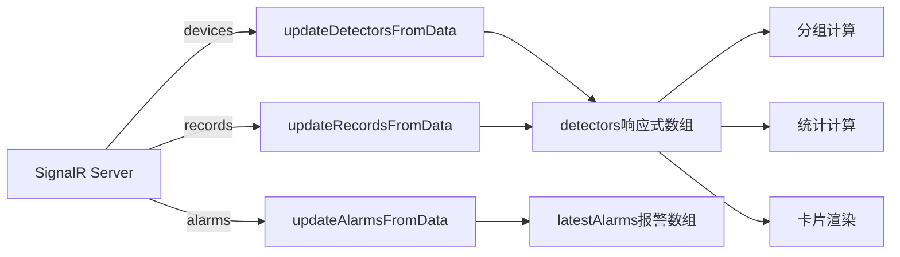

# 卷包车间检测监控中心

## 项目简介

卷包车间检测监控中心是一个基于 Vue 3 + TypeScript + SignalR 的实时监控系统，用于监控车间内各检测设备的运行状态、解码耗时、温度等关键指标，并提供实时告警功能。

## 技术栈

- **前端框架**: Vue 3 (Composition API)
- **语言**: TypeScript
- **实时通信**: SignalR
- **状态管理**: Vue Reactive (ref/computed)
- **构建工具**: Vite
- **样式**: CSS (支持亮色/暗色主题)

## 功能特性

### 1. 实时监控
- 实时显示各设备的状态（在线/离线/心跳异常）
- 实时更新解码耗时和温度数据
- 动态趋势图展示耗时变化

### 2. 阈值告警
- **解码耗时告警**：支持全局阈值和单设备自定义阈值
- **温度告警**：支持全局阈值和单设备自定义阈值
- 告警级别：警告（黄色）、危险（红色）

### 3. 设备管理
- 按产线分组展示设备
- 设备详情弹窗，显示完整信息和报警记录
- 设备卡片快捷操作

### 4. 主题切换
- 支持亮色/暗色主题
- 自动跟随系统偏好
- 用户偏好持久化存储

### 5. 报警中心
- 实时滚动显示最新报警
- 报警级别区分（警告/危险）
- 一键清空报警记录

## 阈值配置说明

### 全局默认阈值

| 指标 | 警告阈值 | 危险阈值 |
|------|---------|---------|
| 解码耗时 | 70 ms | 90 ms |
| 温度 | 45°C | 60°C |

### 自定义设备阈值

每个设备支持独立配置阈值，互不影响：

1. **操作方式**：点击设备卡片右上角的 ⚙️ 图标
2. **配置项**：
    - 解码耗时警告/危险阈值
    - 温度警告/危险阈值
3. **校验规则**：
    - 警告阈值必须小于危险阈值
    - 保存时会进行校验，不符合规则会提示错误
4. **持久化**：配置自动保存到浏览器 localStorage，刷新页面不丢失

### 告警触发条件

| 条件 | UI状态 | 报警记录 |
|------|--------|---------|
| 解码耗时 ≥ 危险阈值 | 红色（危险） | ❌ 不产生报警记录 |
| 解码耗时 ≥ 警告阈值 | 橙色（警告） | ❌ 不产生报警记录 |
| 温度 ≥ 危险阈值 | 红色 | ✅ 产生 danger 级别报警 |
| 温度 ≥ 警告阈值 | 橙色 | ❌ 不产生报警记录 |
| 设备离线/心跳异常 | 灰色 | ✅ 产生报警记录 |
| 设备恢复在线 | 绿色 | ✅ 产生恢复通知 |

## 项目结构

```
src/
├── components/
│   ├── HeaderSection.vue      # 顶部标题栏 + KPI 卡片
│   ├── DetectorGrid.vue       # 设备网格展示
│   ├── DetailModal.vue        # 设备详情弹窗
│   ├── AlarmBar.vue           # 底部报警栏
│   ├── ThemeToggle.vue        # 主题切换按钮
│   └── ThresholdConfig.vue    # 阈值配置弹窗
├── views/
│   └── index.vue              # 主页面
├── utils/
│   └── signal.ts              # SignalR 连接管理
└── types/
    └── detection.ts           # TypeScript 类型定义
```

## 安装与运行

### 环境要求
- Node.js >= 16.0.0
- npm >= 7.0.0 或 yarn >= 1.22.0

### 安装依赖

```bash
npm install
# 或
yarn install
```

### 配置环境变量

创建 `.env` 文件：

```env
VITE_SIGNALR_HUB_URL=/hubs/device
```

### 开发模式

```bash
npm run dev
# 或
yarn dev
```

### 生产构建

```bash
npm run build
# 或
yarn build
```

### 预览构建结果

```bash
npm run preview
# 或
yarn preview
```

## SignalR 接口说明

### 连接配置
- **Hub URL**: `/hubs/device`（可配置）
- **协议**: WebSocket（fallback: Server-Sent Events, Long Polling）

### 数据推送类型

#### 1. devices - 设备状态数据
```javascript
{
    type: "devices",
        arguments [{
        device: "设备IP",
        deviceName: "设备名称",
        lineName: "产线名称",
        stationName: "工位名称",
        status: "OK/NO_READ/OFFLINE",
        lastTotalTime: 0,
        temperature: 0,
        lastHeartbeat: "时间戳"
    }]
}
```

#### 2. records - 检测记录数据
```javascript
{
    type: "records",
        arguments [{
        device: "设备IP",
        deviceName: "设备名称",
        triggerIndex: 0,
        totalTime: 0,
        code: "条码",
        status: "OK"
    }]
}
```

#### 3. alarms - 告警数据
```javascript
{
    type: "alarms",
        arguments [{
        device: "设备IP",
        alarmType: "告警类型",
        message: "告警信息",
        createTime: "时间戳"
    }]
}
```

## 数据流说明



## 响应式设计

- **桌面端**：网格布局，每行自适应显示多个设备卡片
- **平板端**：自适应布局，KPI 卡片换行
- **移动端**：单列布局，优化触控体验

## 主题系统

### 亮色主题（默认）
- 背景色：浅灰色 (#f5f7fa)
- 卡片背景：白色 (#ffffff)
- 文字颜色：深灰色 (#1a2a3a)

### 暗色主题
- 背景色：深灰色 (#0f1419)
- 卡片背景：中灰色 (#1a222a)
- 文字颜色：浅灰色 (#e0e4e8)

### 切换方式
- 点击右上角主题切换按钮
- 自动保存用户偏好
- 自动检测系统主题偏好

## 性能优化

1. **渲染节流**：设备数据更新使用 `THROTTLE_MS = 100ms` 限制渲染频率
2. **趋势图优化**：使用 `requestAnimationFrame` 批量绘制
3. **增量更新**：只更新变化的设备数据，减少 DOM 操作
4. **内存管理**：限制趋势数据点数为 30 个，报警记录为 50 条

## 常见问题

### Q: SignalR 连接失败怎么办？
A: 检查网络连接和 Hub URL 配置，查看浏览器控制台错误信息。

### Q: 设备显示离线但没有报警？
A: 离线报警有 30 秒去重限制，避免频繁报警。

### Q: 自定义阈值丢失了？
A: 阈值保存在浏览器 localStorage，清除缓存会导致数据丢失。

### Q: 温度告警没有触发？
A: 检查温度阈值配置，只有超过危险阈值（默认 60°C）才会触发告警。

## 浏览器兼容性

| 浏览器 | 最低版本 |
|--------|---------|
| Chrome | 90+ |
| Firefox | 88+ |
| Edge | 90+ |
| Safari | 14+ |

## 后续优化方向

- [ ] 历史数据报表导出
- [ ] 设备分组管理（增删改）
- [ ] 告警规则引擎（自定义告警条件）
- [ ] 设备数据大屏展示
- [ ] 移动端 APP 适配

## 维护者

卷包车间信息化团队

## 更新日志

### v1.0.0 (2024-01-xx)
- 初始版本发布
- 支持实时监控和告警
- 支持亮色/暗色主题
- 支持设备自定义阈值配置

---

**注意**：本项目为内部使用系统，请勿将敏感信息提交到公开仓库。
